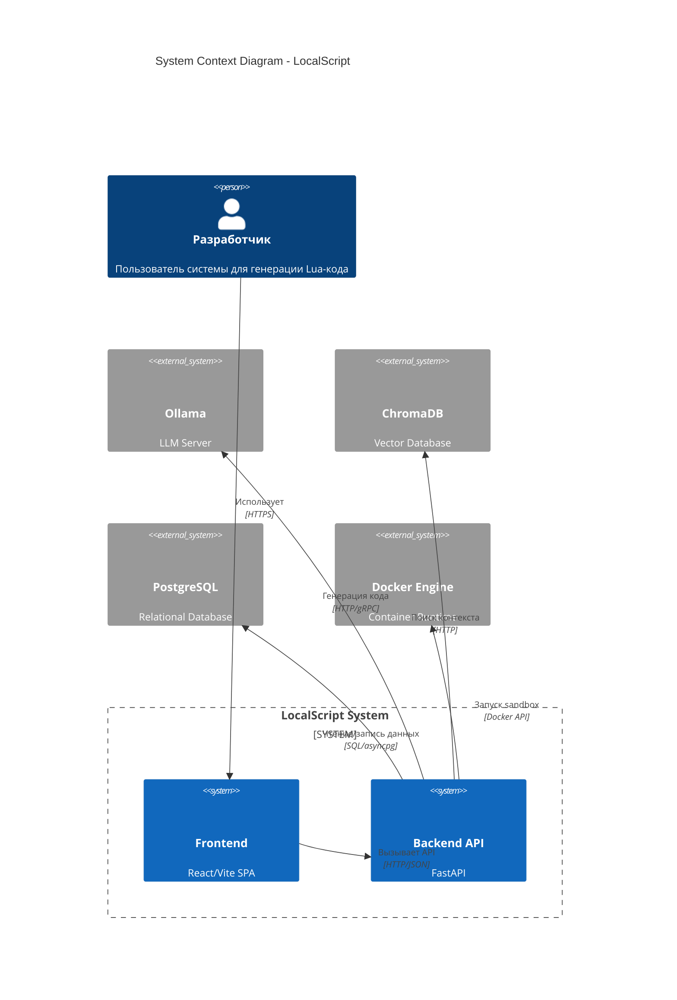
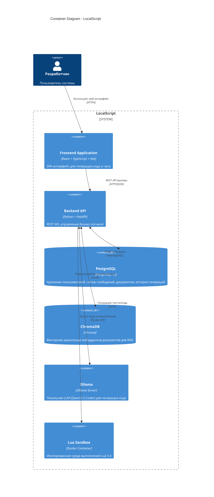
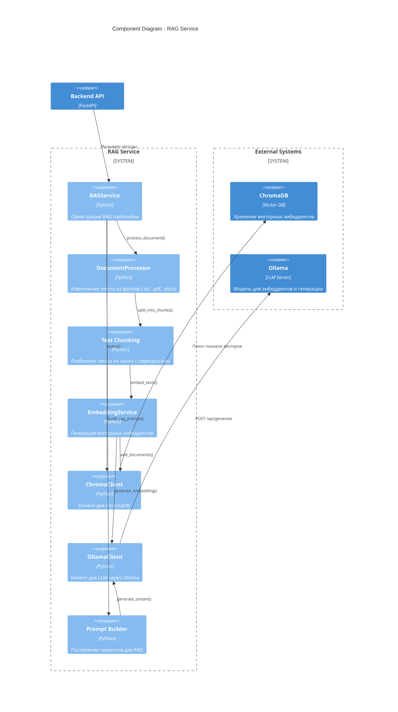
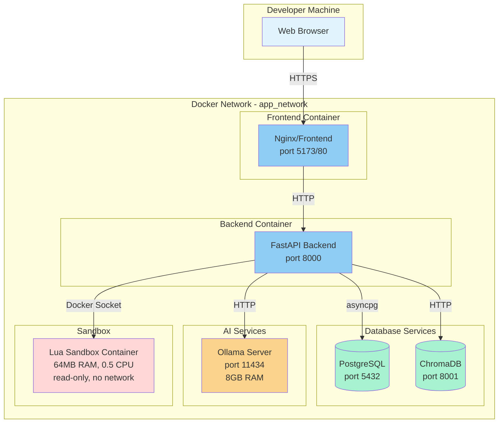
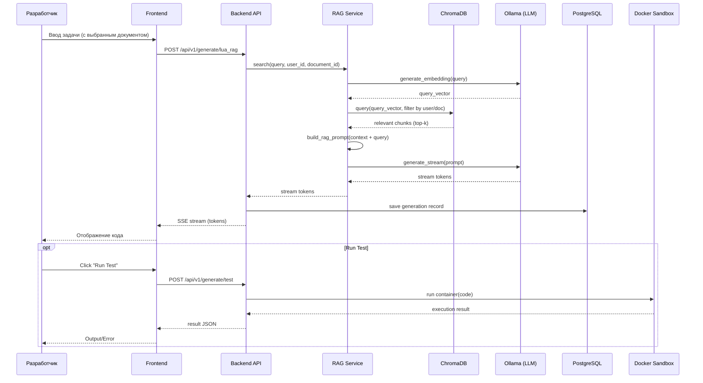

--- C4_ARCHITECTURE.md (原始)


+++ C4_ARCHITECTURE.md (修改后)
# C4 Architecture Diagram - LocalScript Project

## System Context Diagram (Level 1)



## Container Diagram (Level 2)



## Component Diagram - Backend (Level 3)

```mermaid
C4Component
    title Component Diagram - Backend API

    Person(developer, "Разработчик")
    Container(backend, "Backend API", "FastAPI", "Основной бэкенд приложения")

    System_Boundary(api, "API Layer") {
        Component(auth_api, "Auth API", "FastAPI Router", "/api/v1/auth - Аутентификация и регистрация")
        Component(generate_api, "Generate API", "FastAPI Router", "/api/v1/generate - Генерация Lua кода")
        Component(chat_api, "Chat API", "FastAPI Router", "/api/v1/chat - Управление чатами")
        Component(document_api, "Document API", "FastAPI Router", "/api/v1/document - Загрузка документов")
        Component(history_api, "History API", "FastAPI Router", "/api/v1/history - История генераций")
        Component(rag_api, "RAG Generate API", "FastAPI Router", "/api/v1/generate/lua_rag - RAG-генерация")
    }

    System_Boundary(services, "Services Layer") {
        Component(auth_service, "AuthService", "Python", "Управление пользователями, JWT токены")
        Component(generation_service, "GenerationService", "Python", "Создание и обновление генераций кода")
        Component(chat_service, "ChatService", "Python", "Управление чатами и сообщениями")
        Component(document_service, "DocumentService", "Python", "Загрузка и обработка документов")
        Component(user_service, "UserService", "Python", "CRUD операции с пользователями")
        Component(agent_service, "LuaAgentService", "Python", "Агент для генерации Lua кода")
        Component(rag_service, "RAGService", "Python", "RAG пайплайн: индексация, поиск, генерация")
        Component(sandbox_service, "SandboxService", "Python", "Вызов Docker sandbox для выполнения кода")
        Component(llm_client, "LLM Client", "LangChain/Ollama", "Клиент для взаимодействия с Ollama")
        Component(embedding_service, "EmbeddingService", "Python", "Генерация эмбеддингов через Ollama")
    }

    System_Boundary(data, "Data Layer") {
        ComponentDb(models, "SQLAlchemy Models", "ORM", "User, Chat, Message, Document, CodeGeneration")
        ComponentDb(repos, "Repositories", "SQLAlchemy", "Репозитории для доступа к данным")
    }

    System_Boundary(infra, "Infrastructure") {
        Component(config, "Config", "Pydantic Settings", "Конфигурация приложения")
        Component(logging, "Logging", "Python logging", "Логирование событий")
        Component(database, "Database Connection", "AsyncSession", "Подключение к PostgreSQL")
    }

    Rel(developer, auth_api, "POST /login, /register")
    Rel(developer, generate_api, "POST /generate/lua")
    Rel(developer, chat_api, "GET/POST /chat")
    Rel(developer, document_api, "POST /document/upload")
    Rel(developer, history_api, "GET /history")
    Rel(developer, rag_api, "POST /generate/lua_rag")

    Rel(auth_api, auth_service, "Использует")
    Rel(generate_api, generation_service, "Использует")
    Rel(generate_api, agent_service, "Использует")
    Rel(generate_api, sandbox_service, "Использует")
    Rel(chat_api, chat_service, "Использует")
    Rel(document_api, document_service, "Использует")
    Rel(document_api, rag_service, "Использует")
    Rel(history_api, generation_service, "Использует")
    Rel(rag_api, rag_service, "Использует")

    Rel(agent_service, llm_client, "Генерация кода")
    Rel(rag_service, embedding_service, "Создание эмбеддингов")
    Rel(rag_service, llm_client, "Генерация ответов")
    Rel(sandbox_service, "Docker Engine", "Запуск контейнеров", "Docker API")

    Rel(auth_service, repos, "Использует")
    Rel(generation_service, repos, "Использует")
    Rel(chat_service, repos, "Использует")
    Rel(document_service, repos, "Использует")
    Rel(user_service, repos, "Использует")

    Rel(repos, models, "Использует")
    Rel(repos, database, "Выполняет запросы")

    UpdateRelStyle(developer, auth_api, $offsetY="-60")
    UpdateLayoutConfig($c4ShapeInRow="4", $c4BoundaryInRow="2")
```

## Component Diagram - RAG Service (Level 3)



## Component Diagram - Frontend (Level 3)

```mermaid
C4Component
    title Component Diagram - Frontend

    Person(developer, "Разработчик")
    Container(frontend, "Frontend Application", "React + TypeScript + Vite")

    System_Boundary(pages, "Pages") {
        Component(auth_page, "AuthPage", "React Component", "Страница входа/регистрации")
        Component(upload_page, "UploadPage", "React Component", "Загрузка документов")
        Component(chat_page, "ChatPage", "React Component", "Основной чат для генерации кода")
    }

    System_Boundary(components, "UI Components") {
        Component(code_editor, "CodeEditor", "React Component", "Отображение и редактирование кода")
        Component(chat_ui, "ChatUI", "React Component", "Интерфейс чата с сообщениями")
        Component(upload_form, "UploadForm", "React Component", "Форма загрузки файлов")
    }

    System_Boundary(services, "Services") {
        Component(api_client, "ApiClient", "TypeScript", "HTTP клиент для REST API")
        Component(auth_service, "AuthService", "TypeScript", "Управление аутентификацией, localStorage")
        Component(upload_api, "UploadApi", "TypeScript", "API для загрузки документов")
    }

    System_Boundary(types, "Types") {
        Component(types, "Type Definitions", "TypeScript Interfaces", "GenerateRequest, StreamMessage, etc.")
    }

    Rel(developer, auth_page, "Взаимодействует")
    Rel(developer, upload_page, "Загружает файлы")
    Rel(developer, chat_page, "Генерирует код")

    Rel(auth_page, auth_service, "Использует")
    Rel(upload_page, upload_api, "Использует")
    Rel(chat_page, api_client, "Использует")

    Rel(chat_page, code_editor, "Отображает")
    Rel(chat_page, chat_ui, "Отображает")
    Rel(upload_page, upload_form, "Отображает")

    Rel(api_client, "Backend API", "REST/HTTP", "port 8000")
    Rel(upload_api, "Backend API", "multipart/form-data")
    Rel(auth_service, "Backend API", "POST /api/v1/login")

    UpdateRelStyle(developer, auth_page, $offsetY="-50")
    UpdateLayoutConfig($c4ShapeInRow="3", $c4BoundaryInRow="2")
```

## Deployment Diagram



## Data Flow - Code Generation with RAG



## Key Architecture Decisions

### 1. **Local-First AI**
- Ollama для запуска локальных LLM (Qwen2.5-Coder)
- Не требует облачных API ключей
- Полная приватность кода

### 2. **RAG Architecture**
- ChromaDB для векторного поиска
- Поддержка множественных документов
- Per-user изоляция данных
- Deduplication чанков по файлам

### 3. **Secure Code Execution**
- Docker sandbox с ограничениями:
  - 64MB RAM limit
  - 0.5 CPU cores
  - Read-only filesystem
  - No network access
  - tmpfs для временных файлов

### 4. **Async Streaming**
- Server-Sent Events (SSE) для потоковой передачи
- Non-blocking I/O через asyncio
- Real-time отображение генерации

### 5. **Data Persistence**
- PostgreSQL для реляционных данных
- SQLAlchemy ORM с async support
- Alembic для миграций
- JSONB для метаданных

### 6. **Technology Stack**
- **Backend**: Python 3.11+, FastAPI, SQLAlchemy, LangChain
- **Frontend**: React 18, TypeScript, Vite
- **AI**: Ollama, ChromaDB
- **Infrastructure**: Docker, Docker Compose

## External Dependencies

| Component | Technology | Purpose |
|-----------|------------|---------|
| LLM | Qwen2.5-Coder (via Ollama) | Генерация Lua кода |
| Embeddings | nomic-embed-text (via Ollama) | Векторизация документов |
| Vector DB | ChromaDB | Хранение и поиск эмбеддингов |
| Main DB | PostgreSQL 15 | Пользователи, чаты, история |
| Sandbox | Docker + Lua 5.4 | Безопасное выполнение кода |

## Security Considerations

1. **Authentication**: JWT токены, bcrypt hashing
2. **Sandbox Isolation**: Docker containers с resource limits
3. **Input Validation**: Pydantic schemas, length limits
4. **SQL Injection Prevention**: SQLAlchemy ORM parameterized queries
5. **File Upload**: Content-type validation, secure storage